# NameplateBuilder

A server-side nameplate manager for Hytale that lets other mods contribute text segments to it with a fully built-in player UI for customization.

## Downloads

<table>
<tr>
<td align="center" width="50%">
<br/><br/>
<strong>Server Plugin</strong><br/><br/>
<a href="https://www.curseforge.com/hytale/mods/PLACEHOLDER_SERVER_SLUG">

</a>
</td>
<td align="center" width="50%">
<br/><br/>
<strong>API (for mod devs)</strong><br/><br/>
<a href="https://www.curseforge.com/hytale/mods/PLACEHOLDER_API_SLUG">

</a>
</td>
</tr>
</table>

You can download the example mod by going to <a href="https://github.com/TimShol/hytale-nameplate-builder/releases/tag/v1.0.0"> Releases

<!-- [](https://github.com/TimShol/hytale-nameplate-builder/releases/tag/v1.0.0) -->

<!-- TODO: Replace PLACEHOLDER_SERVER_SLUG, PLACEHOLDER_API_SLUG, and PLACEHOLDER_USER with actual values -->

## Documentation

| | |
|---|---|
| **[Modding Guide](docs/MODDING_GUIDE.md)** | API reference, code examples, and integration guide for mod developers |
| **[Project Structure](docs/PROJECT_STRUCTURE.md)** | Architecture, file tree, and internal systems overview for contributors |

---

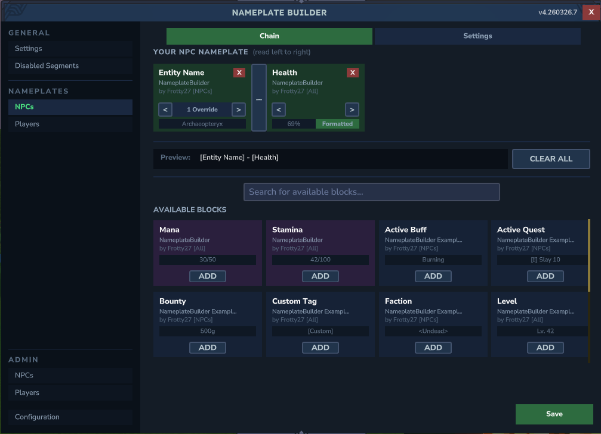
<!-- SCREENSHOT: Full editor window with several blocks in the chain, some in available, and preview visible -->

## Overview

NameplateBuilder solves a core problem for modders and players for Hytale: when multiple mods want to display information above entities (health, guild tags, titles, ranks, etc.), they conflict over the single `Nameplate` component. NameplateBuilder acts as a central aggregator — each mod registers its own named segments, and the system composites them into a single nameplate string per viewer, per entity, every tick (in an efficient way).

Players get a UI to choose which segments they see, reorder them, customize separators between individual segments, pick format variants, configure prefix/suffix wrapping, adjust bar display styles, configure a vertical nameplate offset, and toggle a "only show when looking at entity" mode. Server administrators can force specific segments to always display for all players, disable segments globally, and configure a custom server name. A coloured welcome message is shown on join. Nameplates are automatically cleared when an entity dies.

## Features

### Core

- **Multi-mod nameplate aggregation** — Any number of mods can register their own named segments (health, guild tag, tier, title, etc.) and NameplateBuilder composites them into a single nameplate per entity
- **Built-in segments** — Ships with **Player Name** (with an anonymize variant), **Health**, **Stamina**, and **Mana** (each with current/max, percentage, and visual bar variants). Built-in segments are shown with a distinct warm-purple tint
- **Death cleanup** — Nameplates are automatically cleared when an entity dies, instead of lingering through the death animation
- **Persistent preferences** — All player settings and admin config are saved to disk and survive server restarts

### Welcome Message

- **Coloured join message** — Green when nameplates are available (`[ServerName] - Use /npb to customize your nameplates.`) or red when all segments are admin-disabled (`[ServerName] - Nameplates are disabled on this server.`). Players can toggle this off via General settings

### Player UI

- **Per-player customization UI** — Players open `/npb` to browse, search, add, remove, and reorder nameplate segments from all installed mods
- **Live preview** — Real-time composited text preview with the player's current segment chain and separators
- **Per-block separators** — Each segment can have its own separator to the next segment (or no separator at all)
- **Format variants** — Mods can register multiple display formats per segment (e.g. health as `"42/67"`, `"63%"`, or `"||||||------"`). Players choose their preferred format via a popup
- **Prefix/suffix wrapping** — Custom prefix and suffix text (e.g. `"HP: ["` and `"]"`) to wrap segment output
- **Bar empty-fill customization** — Customize the empty-slot character in visual bar variants (default: `"-"`)
- **Confirm/cancel workflow** — Format changes are previewed live but only persisted on Confirm
- **Nameplate offset** — Configurable vertical offset using invisible anchor entities for hologram-style rendering
- **View-cone filtering** — Optional "only show when looking at" mode (~25 degree cone, up to 30 blocks)

### Admin

- **Required segments** — Force specific segments to always display for all players. Move segments between "Available" and "Required" columns; required segments appear with a yellow tint and cannot be removed
- **Disabled segments** — Globally disable specific segments so they are hidden from all players entirely. When every segment is disabled, nameplates are blanked globally
- **Server name** — Set a custom display name for the join welcome message (defaults to "NameplateBuilder")

## Permissions

| Permission | Description |
|------------|-------------|
| `nameplatebuilder.admin` | Grants access to the admin tabs (Required, Disabled, Settings) in the UI. Without this permission, the ADMIN section is hidden from the sidebar. |

## Player UI

Players open the editor via `/npb` (aliases: `/nameplatebuilder`, `/nameplateui`). The UI features a sidebar on the left:

### Sidebar

| Section | Contents |
|---------|----------|
| **GENERAL** | Settings — master enable/disable, look-at toggle, vertical offset, welcome message toggle |
| **NAMEPLATES** | NPCs — segment chain editor for NPC nameplates |
| | Players — segment chain editor for player nameplates |
| | Disabled — read-only view of all admin-disabled segments |
| **ADMIN** | Required — required segments panel (only visible with `nameplatebuilder.admin` permission) |
| | Disabled — disabled segments panel |
| | Settings — server name configuration |

### General Tab

- **Enable Nameplates** — master toggle to show/hide all nameplates
- **Only Show When Looking** — view-cone filter toggle
- **Show Welcome Message** — toggle the coloured join message on/off
- **Offset** — vertical nameplate offset (accepts both `,` and `.` as decimal separators, clamped to -5.0 to 5.0)

### Editor Tabs (NPCs / Players)

Each editor tab lets players customize nameplates for a specific entity type:

- **Chain** — the player's active segment chain, shown as blocks with move left/right and remove buttons. Each block shows a preview example bar and a Format button when the segment has multiple variants
- **Format popup** — variant selection, prefix/suffix text fields, and bar empty-fill customization with a Confirm/Cancel workflow
- **Preview** — real-time composited text preview, truncated with ellipsis if too long
- **Available Blocks** — all registered segments not yet in the chain, with search/filter, pagination, and an Add button per block
- **Clear All / Save** — remove all blocks or persist the current chain to disk

### Disabled Tab (Player View)

Read-only 4x4 grid of all admin-disabled segments so players can see what has been turned off by the server. Red-tinted backgrounds, no action buttons, with pagination (16 per page).

### Admin Tab

Visible only with the `nameplatebuilder.admin` permission. Contains three sub-tabs:

#### Required Sub-Tab

Two-column layout with a vertical divider. Available blocks are shown with a green tint and the "REQUIRED SEGMENTS" title is orange:

- **Left column ("Available")** — segments that are not required (excludes disabled segments). `>` button to move to required
- **Right column ("Required")** — segments forced on all players. `<` button to move back. Yellow-tinted background

Required segments are always displayed, always included in the nameplate output, still reorderable by players, and cannot simultaneously be disabled. Each column has independent pagination (7 rows per page) with Save and Reset buttons.

#### Disabled Sub-Tab

Same two-column layout, using red-tinted blocks and headers:

- **Left column ("Available")** — segments that are not disabled (excludes required). `>` button to disable
- **Right column ("Disabled")** — segments hidden from all players. Red-tinted backgrounds

When all registered segments are disabled, nameplates are blanked globally and the join message switches to the red "disabled" variant. Each column has independent pagination (7 rows per page) with Save and Reset buttons.

#### Settings Sub-Tab

- **Server Name** — text field for the display name shown in the join welcome message. Defaults to "NameplateBuilder" if left blank. Has Save and Reset buttons.

Admin configuration is persisted in `admin_config.txt`.

---

When a player has no blocks enabled, entities show "Type /npb to customize" as a hint.

## Screenshots

#### Welcome messages

<!-- SCREENSHOT: Chat showing the green welcome message: "[ServerName] - Use /npb to customize your nameplates." in #55FF55 color -->


<!-- SCREENSHOT: Chat showing the red welcome message: "[ServerName] - Nameplates are disabled on this server." in #FF5555 color -->

#### Editor overview

<!-- SCREENSHOT: Full editor window showing the sidebar on the left with GENERAL/NAMEPLATES/ADMIN sections, and the NPC tab active with chain blocks, separators, preview bar, and available blocks grid -->

#### General settings tab
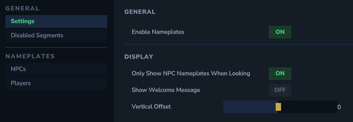
<!-- SCREENSHOT: General tab showing the Enable Nameplates toggle, Only Show When Looking toggle, Show Welcome Message toggle, Offset field, and Save button -->

#### Editor with blocks in chain
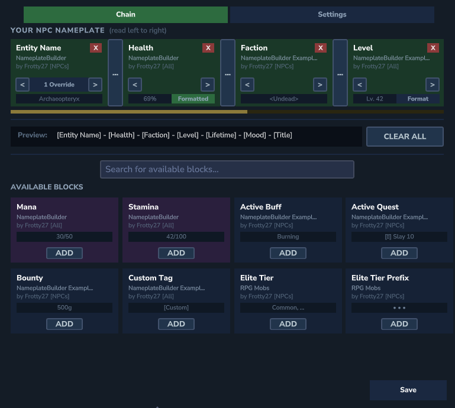
<!-- SCREENSHOT: Editor showing 2-4 blocks in the chain section with example bars visible, separators between them, and more blocks in Available below -->

#### Editor with empty chain

<!-- SCREENSHOT: Editor with "No blocks added yet" in the chain section, all blocks in Available, showing the Clear All and Preview row -->

#### Available blocks with example text
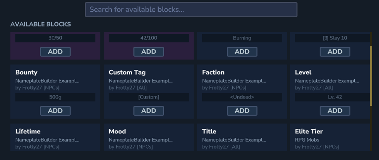
<!-- SCREENSHOT: Close-up of the Available Blocks section showing several blocks with their [All]/[Players]/[NPCs] target tags, author names, and example preview bars (e.g. "67/67", "[Warriors]") -->

#### Built-in blocks in available list

<!-- SCREENSHOT: The Available Blocks section showing built-in segments (Health, Player Name, Stamina, Mana) with their warm-purple background color, distinct from normal mod blocks -->

#### Preview bar
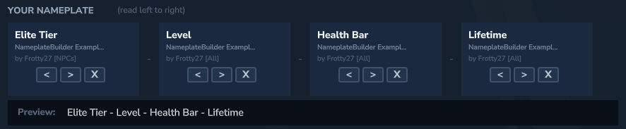
<!-- SCREENSHOT: Close-up of the Preview bar showing composited text like "Health Bar - Guild Tag - Elite Tier" -->

#### Search/filter
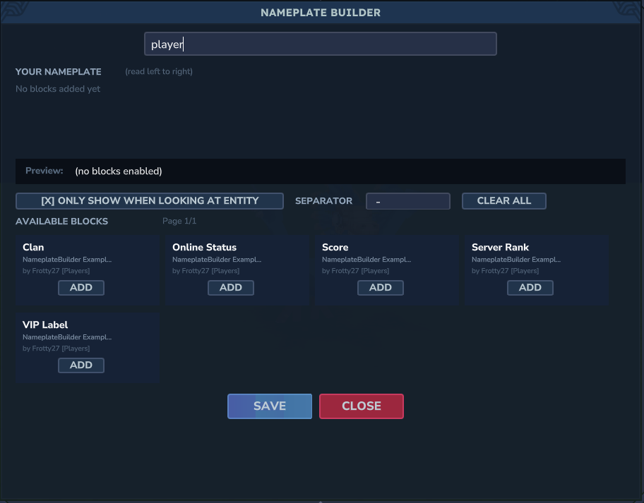
<!-- SCREENSHOT: Editor with a search term typed in the Search field, showing filtered results in Available Blocks -->

#### Chain block with "Formatted" indicator
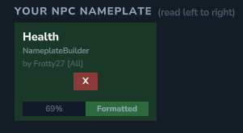
<!-- SCREENSHOT: A chain block (e.g. Health) showing the green "Formatted" button indicating a non-default variant is selected, with the preview bar showing the formatted output (e.g. "||||||------") -->

#### Format popup (variant selection)

<!-- SCREENSHOT: The "Select Format" popup for Health, showing the three variants (Current/Max, Percentage, Bar) with the Bar variant highlighted in green, plus the Prefix/Suffix and Bar Style sections below with example values like "HP: [" and "]" -->

#### Format popup with prefix/suffix
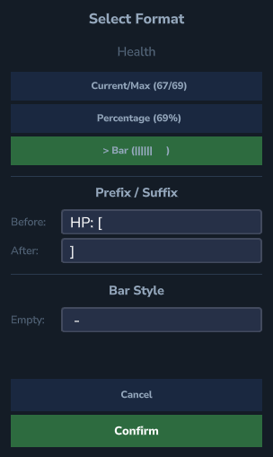
<!-- SCREENSHOT: Close-up of the Format popup's Prefix/Suffix section and Bar Style section, showing "Before: HP: [" and "After: ]" and "Empty: -" fields filled in -->

#### Required segment with yellow outline
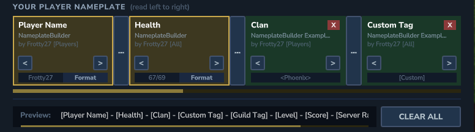
<!-- SCREENSHOT: Editor tab showing a required segment in the chain with yellow-tinted background, no remove button visible, alongside normal green-tinted chain blocks -->

#### Player disabled segments tab
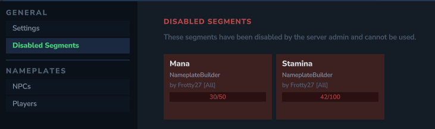
<!-- SCREENSHOT: The Disabled tab in NAMEPLATES section showing a read-only 4x4 grid of admin-disabled segments with red-tinted backgrounds, no action buttons, title "DISABLED SEGMENTS", and pagination -->

#### Admin required segments panel
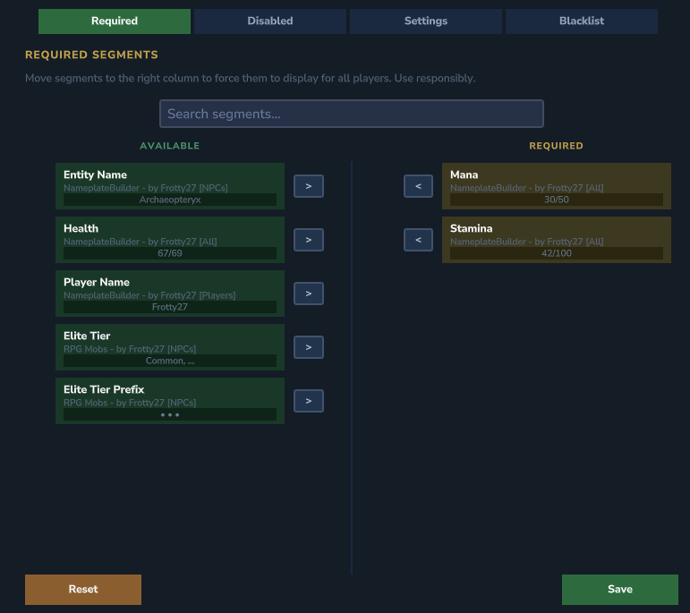
<!-- SCREENSHOT: Admin Required sub-tab showing the two-column layout — left "AVAILABLE" column (green-tinted blocks) with ">" buttons, orange "REQUIRED SEGMENTS" title, 5px vertical divider in the center, right "REQUIRED" column (yellow-tinted) with "<" buttons and segment blocks, pagination under each column, and Save/Reset buttons at the bottom -->

#### Admin disabled segments panel
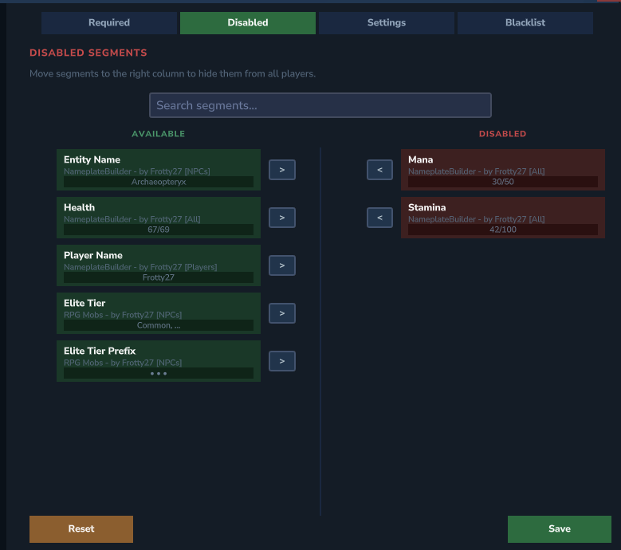
<!-- SCREENSHOT: Admin Disabled sub-tab showing two-column layout — left "AVAILABLE" column (green-tinted) with ">" buttons, right "DISABLED" column (red-tinted #3d2020 backgrounds) with "<" buttons, pagination under each column, Save/Reset buttons -->

#### Admin settings panel
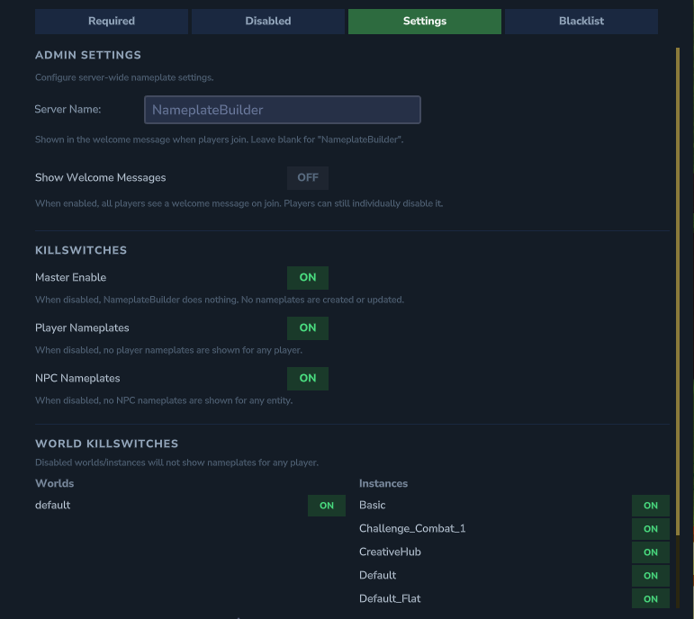
<!-- SCREENSHOT: Admin Settings sub-tab showing the Server Name text field with label, description text explaining what it does, and Save/Reset buttons with feedback label -->

#### In-world nameplate on NPC

<!-- SCREENSHOT: An Archaeopteryx NPC in the game world with a nameplate above it showing something like "42/67 - [Elite] - Lv. 5 - [Warriors]" -->

#### In-world nameplate with custom selection
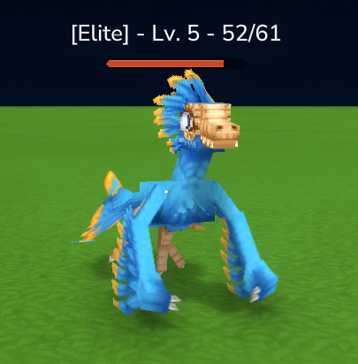
<!-- SCREENSHOT: An Archaeopteryx NPC showing a nameplate with only 1-2 segments selected (e.g. just "Health Bar") to demonstrate per-player customization -->

#### In-world nameplate with bar variant

<!-- SCREENSHOT: An entity in the game world showing a nameplate with the health bar variant, e.g. "HP: [||||||------]" with custom prefix/suffix -->

#### Player name anonymized

<!-- SCREENSHOT: A player entity showing "Player" instead of their real name, demonstrating the anonymize variant -->

#### Empty nameplate hint
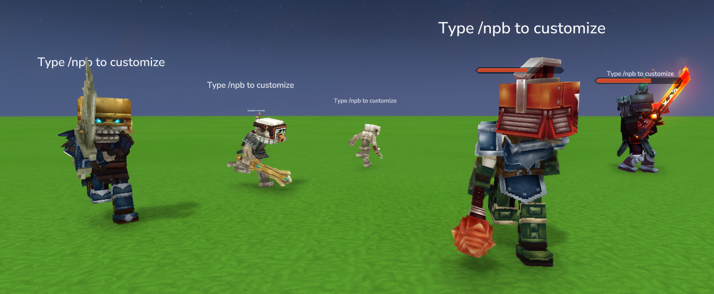
<!-- SCREENSHOT: An entity (player or NPC) showing "Type /npb to customize" as nameplate text when no blocks are enabled -->

## Building

**Requirements:**
- Java 25
- Gradle 9.2+
- Hytale Server build-7 jar installed at the default location

```bash
./gradlew build
```

This compiles all three modules, packages shadow JARs, and deploys the server plugin and example mod to your Hytale `UserData/Mods` folder.

## License

This project is licensed under the [MIT License](LICENSE).
